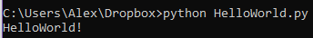
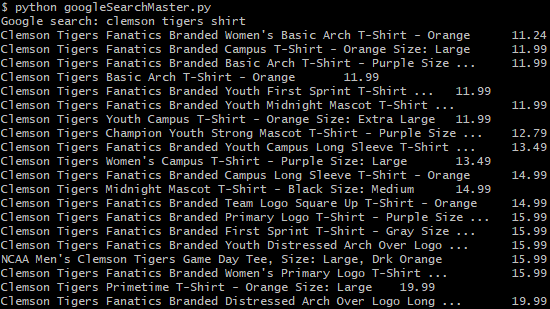

# Learning Python
## - Simple and intuitive syntax
## - Versatile and powerful
 

# Installing Python 3.7
## [Python's Website (python.org)](https://www.python.org/ "Python's Home")
### - Install Python 3.7.4


# Printing HelloWorld
### - Create `HelloWorld.py`
```python
print("HelloWorld")
```
### - Run `python HelloWorld.py`



# [Starting with Selenium](https://selenium-python.readthedocs.io/)
### - Navigate to root director (`cd`)
```python 
pip install selenium
```
### - [Find your Chrome version](https://superdevresources.com/tools/whatversion)
### - [Install a ChromeDriver](https://sites.google.com/a/chromium.org/chromedriver/downloads)
### - Save it somewhere you can find it or with your project
### - Copy the path `C:\Users\Alex\Dropbox\Workshop\Selenium\chromdriver.exe`
### - Create your file `googleSearch.py`
```python
from selenium import webdriver
from selenium.webdriver.common.keys import Keys
```
```python
driver = webdriver.Chrome("C:/Users/Alex/Dropbox\Workshop\Selenium\chromedriver.exe")
driver.get("http://www.python.org")
```


# Creating the Search
```python
from selenium import webdriver
from selenium.webdriver.common.keys import Keys

query = input("Google search: ")

driver = webdriver.Chrome("chromedriver.exe")
driver.get("http://www.google.com/shopping")
```
##  Right click, inspect element
```python
search = driver.find_element_by_xpath("/html/body/gx-app/div[1]/gx-navigation-bar-ce/header/div/div[2]/gx-search-bar/div/form/div/input")
```
##  We're going to choose to be specific: `clemson tigers shirt`
```python
search.send_keys(query)
search.submit()
```
# Next Steps
##  Add elements to a dictionary
```python
results = {}
products = driver.find_elements_by_class_name("sh-dgr__grid-result")
for element in products:
    price = element.find_element_by_class_name("Nr22bf").text
    results[element.find_element_by_class_name("EI11Pd").text] = float(price[1:len(price)-1])
```
##  Sort based on price
```python
sortedResults = {}
while len(results.keys()) > 0:
    min = 1000000
    key = ""
    for i in results:
        if results[i] < min:
            min = results[i]
            key = i
    sortedResults[key] = min
    del results[key]
```
##  Sanity check
```python
for element in sortedResults:
    print(element, "\t", sortedResults[element])
```
